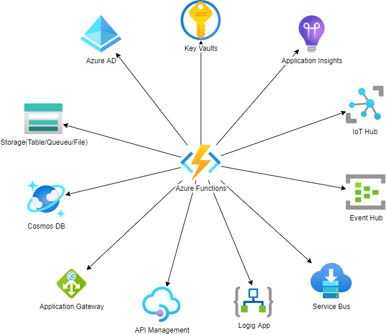
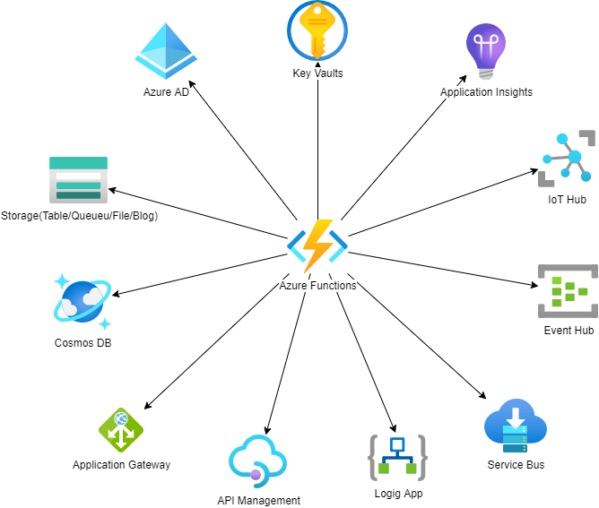

# az-func-learn-plus

 

Azure Functionsは他のAzureサービスと簡単に連携できる仕組みが提供されており、様々なサービスを連携させ簡単に高度なシステムが構築できるように準備されています。



このリポジトリではFunctionsとAzureのその他のサービスの連携を確認します。

## 連携するAzureサービス(機能)

| フォルダ名 | Azure Service名 | 機能の概要 |
| --- | --- | --- |
| 1_auth | Azure AD | 組み込みの認証 |
| 2_signalR | Azure SignalR | 双方向通信 |
| 3_pubsub | Azure PubSub | 双方向通信 Websocket通信|
| 4_iot | Azure IoT Hub | IoT向けサービス MQTT |
| 5_keyvault | Key Vault | パスワードなどの秘匿情報の取り扱い |
| 6_cicd | CI/CD | CI/CDについて<br>GitHub Actionの簡単なサンプル |
| 7_appi | Application Insights | ロギング・モニタリング |
| 8_staticweb | Static Web App | 静的コンテンツの配信サーバーとして利用可能？ |

## Azure functions リソース準備
Resource Group, Storage,  FunctionsApp
```
# resource group
az group create -n az-func-example-rg -l japaneast

# storage
az storage account create -n funcstorage0001 -g az-func-example-rg -l japaneast --sku Standard_LRS --kind StorageV2
az storage account show-connection-string -g az-func-example-rg -n funcstorage0001

# application insights
az monitor app-insights component create --app my-example-appi --location japaneast --kind web -g az-func-example-rg --application-type web

# functions
az functionapp create -g az-func-example-rg --consumption-plan-location japaneast --runtime node --runtime-version 14 --functions-version 4 --name my-example-func --storage-account funcstorage0001 --app-insights my-example-appi --app-insights-key <xxxx>
```

※従量課金プランで作成しているので開発中は不用意にスケーリングされないようにScaleLimitを設定しておきます。
```
az resource update --resource-type Microsoft.Web/sites -g az-func-example-rg -n my-example-func/config/web --set properties.functionAppScaleLimit=1
```

FTPベースのデプロイは利用しない場合無効にしておく
```
az webapp config set --name my-example-func --resource-group az-func-example-rg --ftps-state Disabled 
```

## Functions Core tools
良く利用するコマンド
```
# プロジェクトの初期化
func init --worker-runtime node --language javascript
# 関数の追加
func new
# 関数のデプロイ
func azure functionapp publish my-example-func
func azure functionapp publish my-example-func --publish-local-settings -y

# ログの確認
func azure functionapp logstream my-example-func
```

# (注意) 不要になったら削除する
```
az group delete --name az-func-example-rg -y
```