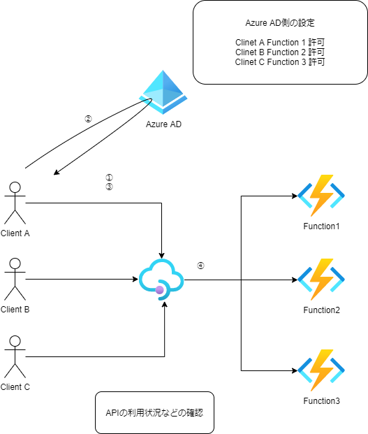
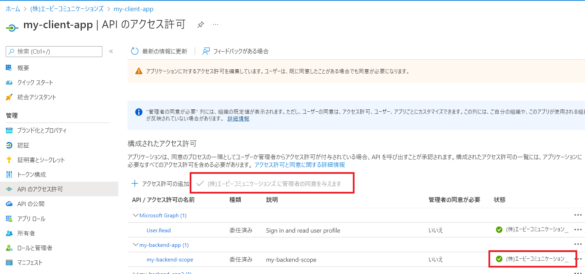
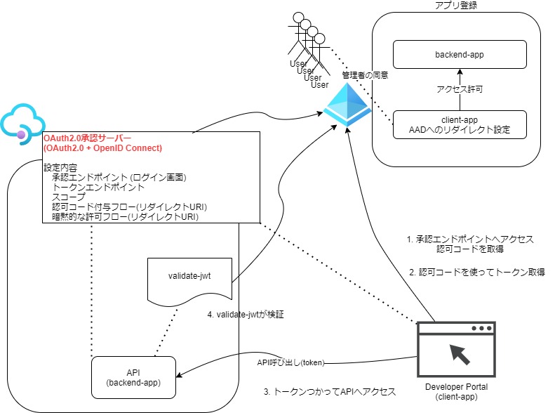

# API Management

認証/承認, レートリミット, 収益化APIなどを確認する。

 

## APIMは3つのコンポーネントで構成

 

```
APIゲートウェイ クライアントの接続先
管理プレーン 管理機能(Azure portal, Azure CLIなどを利用してアクセス)
開発者ポータル 自動的に生成され、完全にカスタマイズ可能な、API のドキュメントが含まれる Web サイト
```

## API Managementの作成

(注意) Activateされるまでに30分以上時間がかかるので余裕をもって作成する。

作成
```
# create apim (--sku-name Developer)
az apim create --name my-example-apim --sku-name Developer --resource-group az-func-example-rg -l japaneast --publisher-name my-example-apim-orgname --publisher-email t_okuyama@ap-com.co.jp --no-wait
```

作成状態の確認
```
az apim list --output table
az apim show --name my-example-apim --resource-group az-func-example-rg --output table
```

削除
```
az apim delete -n my-example-apim1 -g az-func-example-rg
```

https://docs.microsoft.com/ja-jp/rest/api/apimanagement/current-ga/deleted-services/purge#code-try-0
論理削除でない完全な削除(Purge)　※AzureCLIのwebから「使ってみる」ボタンを押して実行することが可能
※認証情報が必要
```
DELETE https://management.azure.com/subscriptions/{subscriptionId}/providers/Microsoft.ApiManagement/locations/{location}/deletedservices/{serviceName}?api-version=2021-08-01
```


## Azure Function App を API としてインポートする

https://docs.microsoft.com/ja-jp/azure/api-management/import-function-app-as-api

Function Appに直接アクセス
```
curl https://my-example-func.azurewebsites.net/api/HttpTrigger?code=wRFLu-iv4yKEDSlf67xv3PjFa_WvxCVNneNZ3ixr6Q3vAzFuqhqzIQ==
```

APIM経由でアクセス
```
curl -H "Ocp-Apim-Subscription-Key: 4647636621d44bf9a522eba28152a2cc" https://my-example-apim1.azure-api.net/my-example-func/HttpTrigger
```

# OAuth 2.0 ユーザー承認 を使ってみる

OAuth 2.0 ユーザー承認を構成して開発者ポータルのテスト コンソールを承認する方法

https://docs.microsoft.com/ja-jp/azure/api-management/api-management-howto-oauth2
基本的にはこの手順にしたがって設定していく。

作成と設定
```
APIを表すアプリ
クライアントを表すアプリ
API ManagementでOAuth 2.0 ユーザー承認を使用する
```

認可付与タイプ（認可フロー）
```
Authorization code (承認コード)
 トークンの認可コードを交換する。Webでよく利用される
```

## (注意) accessTokenAcceptedVersion

v2 エンドポイントを使用する場合: * [既定のスコープ] フィールドに、作成したバックエンド アプリ スコープを入力します。 * バックエンド アプリとクライアント アプリの両方の登録のためのアプリケーション マニフェストで、accessTokenAcceptedVersion プロパティの値を 2 に設定します。

マニュフェストの例：
```
{
	"id": "02337bed-f2a8-4f87-8af0-0d10d92afde8",
	"acceptMappedClaims": null,
	"accessTokenAcceptedVersion": 2,
```

APIMに設定する下記のvalidate-jwtはv2です。
```
<validate-jwt header-name="Authorization" failed-validation-httpcode="401" failed-validation-error-message="Unauthorized. Access token is missing or invalid.">
    <openid-config url="https://login.microsoftonline.com/<tenant-id>/v2.0/.well-known/openid-configuration" />
    <required-claims>
        <claim name="aud">
            <value><backend-app-id></value>
        </claim>
    </required-claims>
</validate-jwt>
```

## (注意) APIの公開(スコープ) 同意できるユーザの選択
同意できるユーザの選択で「管理者とユーザー」「管理者のみ」が選択できる。

「管理者のみ」を選択した場合、[<お使いのテナント名> に管理者の同意を与えます]をクリックするしないと一般ユーザーは利用できない。



## テスト コンソール で取得できたToken

テスト コンソール で取得したTokenをcURLでHeaderに付けてAPIが呼べることを確認した。

```
curl -H "Ocp-Apim-Subscription-Key: xxx" -H "Authorization: Bearer <yyy...yyy>" https://my-example-apim1.azure-api.net/my-example-func/HttpTrigger
```

## ここまでの構成の理解

これは認可コードフローと呼ばれるフロー。



1. 認可コードの取得
2. 認可コードをつかったトークンの取得
3. トークンをつかってAPIの呼び出し (-H "Authorization: Bearer <yyy...yyy>")
4. validate-jwtで検証

# 参考
このサイトの情報がすごくよく纏められている
https://tech-lab.sios.jp/archives/25470

https://datatracker.ietf.org/doc/html/rfc6749#section-4.1