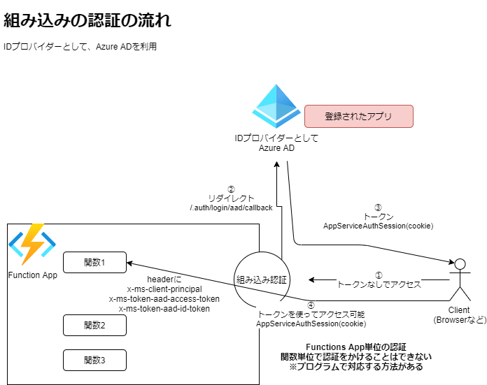

# Functionsで組み込みの認証(Azure AD)を利用してみる

Azure ADによる認証/承認の機能が組み込みの認証として利用可能。  
Functionsの認証設定から簡単に有効にすることができる。

https://docs.microsoft.com/ja-jp/azure/app-service/configure-authentication-provider-aad

※IDプロバイダーとして、Facebook, Github, Google, Twitterなどが利用可能。

# 組み込みの認証(Azure AD)の流れ

 

# 認証/承認についての基礎

## プロトコル
|  |  | | プロトコル |
| --- | --- | --- | --- |
| 認証 | AuthN | 本人確認 | OpenID Connect |
| 承認（認可） | AuthZ | 認証されたあとに、実行権限の付与 | OAuth 2.0 |

## 認証フロー
| フロー | 説明 |
| --- | --- |
| サーバー主導のフロー |　プロバイダーのログインページをユーザーに表示する。 <br>一般的なブラウザでよく利用されるパターン。|
| クライアント主導のフロー | クライアント側でプロバイダーのSDKを利用してサインインさせ、App Servcieに認証トークンを送信する。<br> |　

## IDトークンとアクセストークン
(特徴) IDトークン
```
OpenID Connect(OAuth2.0 + Identity Layer)  
JWTがよく利用される  
SSO(シングルサインオン)
識別子型・内包型
Revacation List, OSCP
```

(特徴) アクセストークン
```
OAuth2.0  
HTTP Header Authrization: barar xxxx によく設定される
```


# Azure CLI
サービスプリンシパル
```
az ad sp list
az ad sp create-for-rbac --name durable-sample-func-sp --scopes /subscriptions/d79e0410-8e3c-4207-8d0a-1f7885d35859/resourceGroups/az-func-example-rg
az ad sp delete --id 00000000-0000-0000-0000-000000000000
```

アプリ登録
```
az ad app list
az ad app show --id
az ad app create --display-name my-durable-func --reply-urls "https://durable-sample-func.azurewebsites.net/.auth/login/aad/callback" --oauth2-allow-implicit-flow true 
az ad app delete --id ddf89e1a-ea70-4d46-b1e2-a6847fdb055d
```