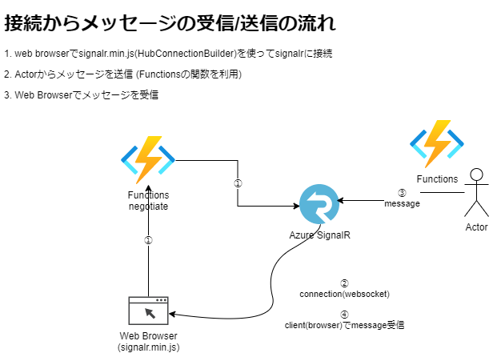

# FunctionsでSignalRを利用してみる

https://docs.microsoft.com/ja-jp/azure/azure-signalr/signalr-overview

ASP.NET SignalRとはリアルタイム Web 機能を追加するプロセスを簡略化する、開発者向けのライブラリ

## 用途
サーバーからクライアントにリアルタイムでデータをプッシュすることができる
```
頻度の高いデータの更新
ダッシュボードと監視
チャット
地図上のリアルタイムの位置
対象を絞ったリアルタイムの広告
コラボレーションアプリ(ホワイトボードなど)
プッシュ通知
リアルタイムのブロードキャスト
Iotデバイス
オートメーション
```

## SignalR インスタンス作成
sku freeで作成
```
az signalr create -n MySignalRExample01 -g az-func-example-rg --sku Free_DS2 --service-mode Serverless --enable-message-logs True
```

## 接続からメッセージ受信・送信の流れ

 
