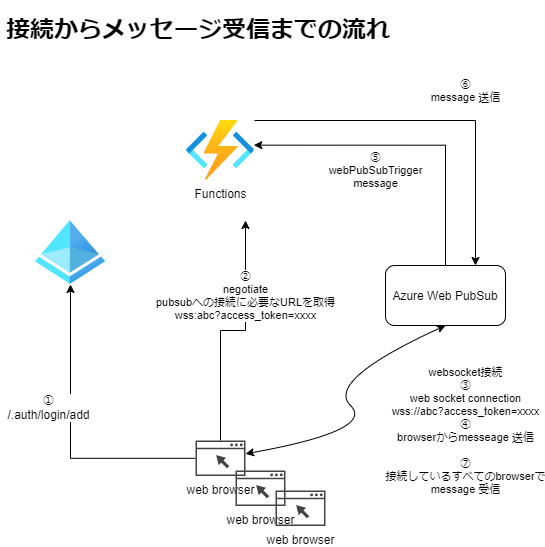

# FunctionsでWeb PubSub を利用してみる

https://docs.microsoft.com/ja-jp/azure/azure-web-pubsub/quickstart-serverless?tabs=javascript

## SignalRとの違い
websocketをそのまま利用するので、SignalRのようにライブラリを利用する必要がない。
接続できるクライアントに制限がない。

## 用途
※SignalRと同様の用途
```
頻度の高いデータの更新
ダッシュボードと監視
チャット
地図上のリアルタイムの位置
対象を絞ったリアルタイムの広告
コラボレーションアプリ(ホワイトボードなど)
プッシュ通知
リアルタイムのブロードキャスト
Iotデバイス
オートメーション
```

## Azure SignalRとの違い
機能的にはほぼ同様
すでにSignalRを利用している場合はSignalRを選択する
SignalRはASP.NETを利用する場合は.NET エコシステム (Blazor など) と統合できる。Blazorとは.NETでクライアント側 Web UI (SPA) を構築するためのフレームワーク。
PubSubはの方は汎用的なWebSocketサービスとなり、SignalRライブラリが不要なためクライアントを選ばない。

## Web PubSub インスタンス作成
```
az webpubsub create --name "az-func-pubsub-example" --resource-group "az-func-example-rg" --location "japaneast" --sku Free_F1
az webpubsub key show --name az-func-pubsub-example --resource-group az-func-example-rg
```


## 接続からメッセージ受信・送信の流れ

sampleアプリでのメッセージの送受信の流れ



