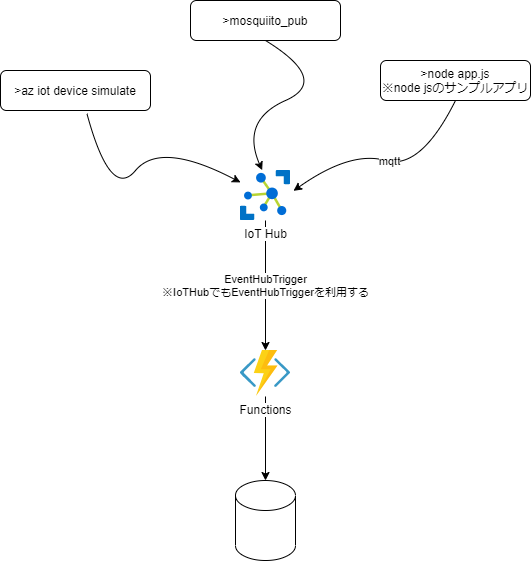

# FunctionsでIoT Hubを利用してみる

※MQTT v5は現在プレビュー

## IoT Hub クイックスタートで確認

https://docs.microsoft.com/ja-jp/azure/iot-hub/quickstart-send-telemetry-cli

クイックスタートを動かして概要を理解する

IoTハブの作成 (FreeレベルなければS1レベルで作成。)
```
az iot hub create --resource-group az-func-example-rg --name MyIoTHubExample --sku F1 --partition-count 2
```

デバイスの作成 
```
az iot hub device-identity create --hub-name MyIoTHubExample --device-id simDevice 
```

Terminal1 でsimulateを実行
```
az iot device simulate -d simDevice -n MyIoTHubExample
```

Terminal2でモニターしてみるとメッセージを受け取っていることが確認できる
```
az iot hub monitor-events --output table --hub-name MyIoTHubExample
```

Terminal2でメッセージを送信すると、Teminal1でメッセージを受信することが確認できる
```
az iot device c2d-message send -d simDevice --data "Hello World" --props "key0=value0;key1=value1" -n MyIoTHubExample
```

ポータルのメトリックでもメッセージが確認できます。

```
az iot hub device-identity list -n MyIoTHubExample -o table
```

## Functionsとの連携

https://docs.microsoft.com/ja-jp/azure/azure-functions/functions-bindings-event-iot?tabs=in-process%2Cextensionv5&pivots=programming-language-javascript

注意! IoT Hub のサポートは、Azure Event Hubs のバインドを利用する

### 動作確認(`az iot device simulate`コマンド)

コマンドでデータを送信してみると、Functionsの関数が動いていることが確認できる。
```
az iot device simulate -d simDevice -n MyIoTHubExample
```

### 動作確認(mosquittoクライアント)

デバイスの作成
```
az iot hub device-identity create -n MyIoTHubExample --device-id mosquittoDevice
```

SASでアクセスするためにトークンを準備
```
az iot hub generate-sas-token -n MyIoTHubExample
```

subscribe
```
mosquitto_sub -d -q 1 \
  -V mqttv311 \
  -p 8883 \
  -h MyIoTHubExample.azure-devices.net \
  -i mosquittoDevice \
  -u "MyIoTHubExample.azure-devices.net/mosquittoDevice/?api-version=2021-04-12" \
  -P "SharedAccessSignature sr=MyIoTHubExample.azure-devices.net&sig=BBBReiQRXXrXP2Dovnoo58cuR8va%2BrM1AVFjCZGPTx8%3D&se=1652943741&skn=iothubowner" \
  -t "devices/mosquittoDevice/messages/events/"
```

publish
```
mosquitto_pub -d -q 1 \
  -V mqttv311 \
  -p 8883 \
  -h MyIoTHubExample.azure-devices.net \
  -i mosquittoDevice \
  -u "MyIoTHubExample.azure-devices.net/mosquittoDevice/?api-version=2021-04-12" \
  -P "SharedAccessSignature sr=MyIoTHubExample.azure-devices.net&sig=BBBReiQRXXrXP2Dovnoo58cuR8va%2BrM1AVFjCZGPTx8%3D&se=1652943741&skn=iothubowner" \
  -t "devices/mosquittoDevice/messages/events/001" \
  -m '{"message":"hi this is test message from mosquitto_pub"}'
```

`-t`でtopicを指定するが `"devices/{DeviceId}/messages/events/` の形式とする

### 動作確認(javascriptのサンプルアプリ)
※mqtt_client_jsフォルダ

https://github.com/Azure/azure-iot-sdk-node/tree/main/device
を参考に作成しています。

デバイスの作成
```
az iot hub device-identity create --hub-name MyIoTHubExample --device-id mqtt_client_js1
```

実行
```
cd mqtt_client_js
npm install
node app.js
```
サンプルを実行すると、Functionsがトリガーされることが確認できる。


# まとめ

IoTソリューションなどで、多数のデバイス(百万クライアントとか)の同時接続が必要な場合に利用する。


このサンプルで試した構成は下記の通り。
