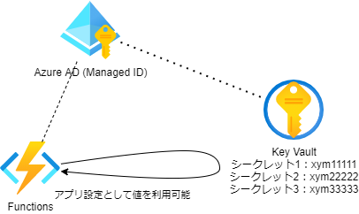
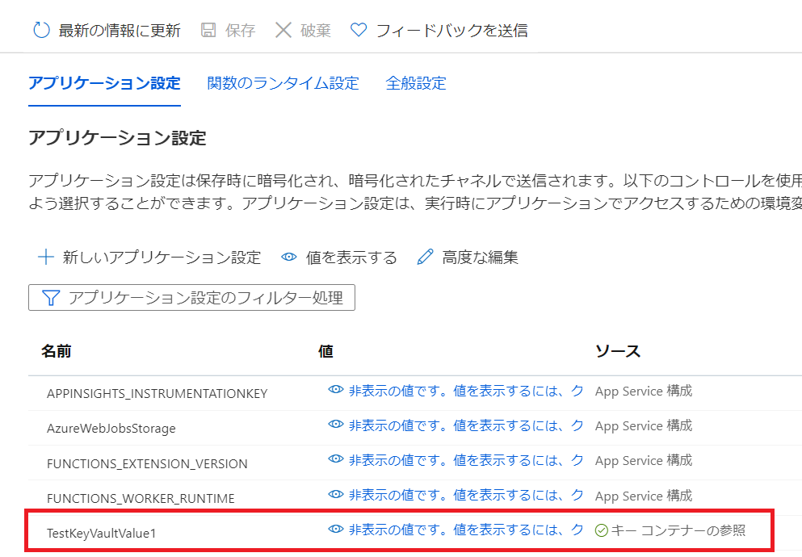

# FunctionsでKey Vaultを利用してみる

Key Vaultの基本的な利用方法 (Managed IDを利用してKeyVaultを参照する)

 


## Key Vaultの作成

コンテナの作成
```
az keyvault create --name "my-func-example-kv" --resource-group "az-func-example-rg" --location "japaneast"
```

※作成したコンテナを完全に削除したい場合は、purgeが必要
```
az keyvault purge -n my-func-example-kv
```

シークレットの追加
```
az keyvault secret set --vault-name "my-func-example-kv" --name "ExamplePassword" --value "hVFkk965BuUv"
```
シークレットの参照
```
az keyvault secret show --name "ExamplePassword" --vault-name "my-func-example-kv" --query "value"
```


## FuncstionsにKey Vaultの参照権限を与える
FunctionsのManaged IDを有効/無効にする (例)
```
az functionapp identity assign -g az-func-example-rg -n my-example-func
#az functionapp identity remove
az functionapp identity show -g az-func-example-rg -n my-example-func
```
※サービスプリンシパルでもOK。

Key Vaultのアクセスポリシーの割り当てを行う  
※`--object-id`でFunctionsのManaged IDを指定してポリシーを割り当てる
```
az keyvault set-policy --name my-func-example-kv --object-id d68e2508-7a2a-4136-a21c-dd790a6a27a2 --secret-permissions get
```

## Funcstions appからKeyVaultを参照する

Functionsのアプリケーション設定の値に書きのように設定することでKeyVaultを参照します。
```
@Microsoft.KeyVault(SecretUri=https://my-func-example-kv.vault.azure.net/secrets/ExamplePassword/xxx)
```
アプリケーションからは通常のアプリケーション設定(環境変数)として扱うことができます。

 