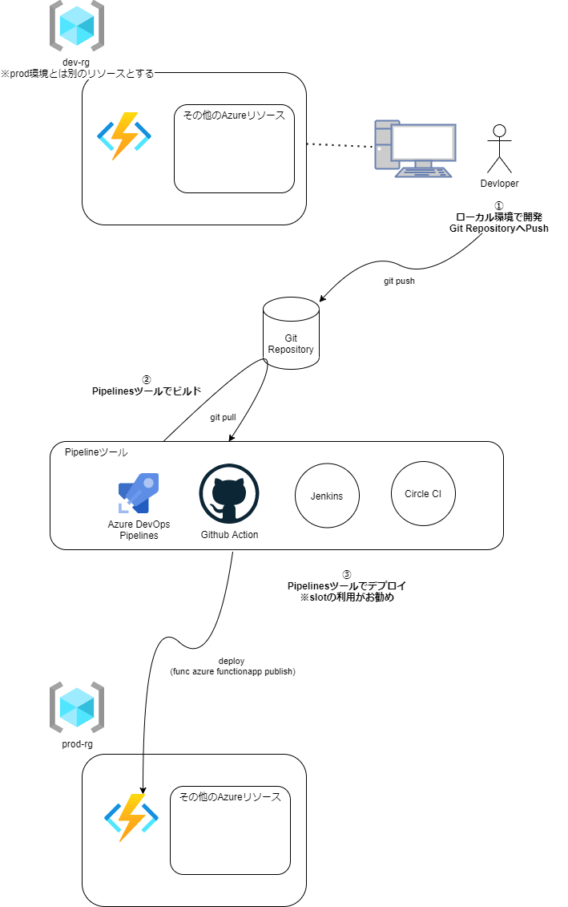

# FunctionsでCI/CD環境を構築してみる

CI/CDツールにはJenkins,CircleCI,AzureDevOps, GitHubActionなど様々なツールがあるが、基本的にはどれでも利用可能。

## CI/CD フローの例

### Functions(node)の開発からデプロイについての理解
基本的な流れは
1. ローカルでコーディング
2. ローカルでテスト (`func start`, `npm start`)
3. Azureへのデプロイ (`func azure functionapp publish`)
4. Azureでの動作確認

※開発のフロー自体はチームや環境に合わせて変更していく。

少し実践的な開発・デプロイのフローとして検討してみる
前提条件：開発環境/本番環境など複数扱う

 

## GitHub Actionの利用

https://docs.microsoft.com/ja-jp/azure/azure-functions/functions-how-to-github-actions?tabs=dotnet

