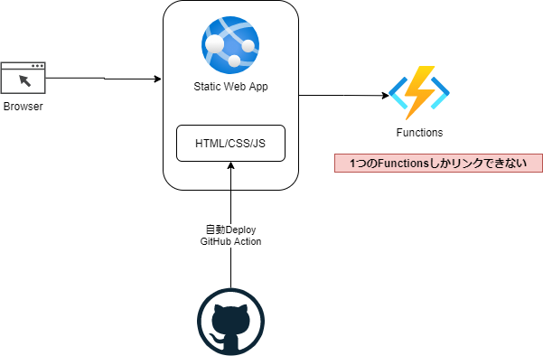

# Azure Static Web Apps

Webホスティング  
Functionsとの統合  
CICD(DevOps,GitHub)  
グローバルに分散  

https://docs.microsoft.com/ja-jp/azure/static-web-apps/get-started-cli?tabs=vanilla-javascript

 

## staticwebapp作成
```
az staticwebapp create --name my-first-static-web-app --resource-group az-func-example-rg --source https://github.com/$GITHUB_USER_NAME/my-first-static-web-app --location "eastasia" --branch main --app-location "./src" --login-with-github --sku Standard
```
※`--location` japaneastはない
※独自のFunctionsをリンクするためには`--sku Standard`が必要

## Git Repositoryとの連携について
GitHub, DevOpsと連携しないといけない。

## Functionsと連携について

ポータルから既存のFunctionsのリンクを設定できる。  

以下の２つは同じ内容になる
````
curl https://my-example-func.azurewebsites.net/api/HttpTrigger
curl https://red-stone-014cb4e00.1.azurestaticapps.net/api/httptrigger
````

Functions連携時の注意点
```
１つの静的アプリでリンクできるのはFunctionsアプリは１つのみ。
FunctionsにIPアドレスの制限がかけれないプライベートリンク
Functionsにアクセスキーが必要な場合は、静的アプリからキーを指定する必要がある
```

